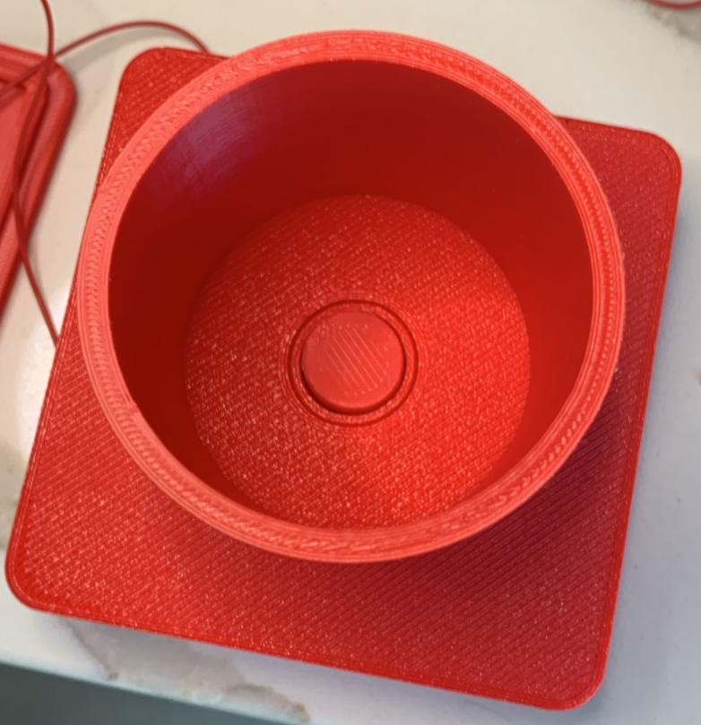

# Presplate



| Supported Targets | ESP32-C6 | ESP32-H2 |
| ----------------- | -------- | -------- |

## Battery powered boot switch-on

You need to git clone esp-idf as prerequisite https://github.com/espressif/esp-idf (tested while master was at commit 38628f9)

At the bottom of the custom holder is one of these https://www.printables.com/model/1093182-arcade-buttons-182430mm-with-tiny-micro-switches

```
source esp-idf/export.sh
```
This test code shows how to configure Zigbee end device and use it as HA to notify this device got switched on.
It works with hubitat C7
The ESP Zigbee SDK provides more examples and tools for productization:
* [ESP Zigbee SDK Docs](https://docs.espressif.com/projects/esp-zigbee-sdk)
* [ESP Zigbee SDK Repo](https://github.com/espressif/esp-zigbee-sdk)

## Hardware Required

* One development board with ESP32-H2 SoC acting as Zigbee end-device
* A USB cable for power supply and programming

## Configure the project

Before project configuration and build, make sure to set the correct chip target using `idf.py --preview set-target TARGET` command.

## Erase the NVRAM

Before flash it to the board, it is recommended to erase NVRAM if user doesn't want to keep the previous examples or other projects stored info using `idf.py -p PORT erase-flash`

## Build and Flash

Build the project, flash it to the board, and start the monitor tool to view the serial output by running `idf.py -p PORT flash monitor`.

(To exit the serial monitor, type ``Ctrl-]``.)

## Switch Behavior

The switch is normally open when the device is docked, and it closes only when you lift it out of its holder (as shown above). This action powers up the ESP32, which immediately checks in with the coordinator. To ensure a successful check-in, the device waits up to 30 seconds for the coordinator to turn it back off.

After first boot it will try to pair with coordinator.
Everytime the device gets powered it will send 'switch-on' attriibute to the coordinator.
When it receives 'switch-off' it goes into deep sleep (also after a timeout in case we forget to turn it off for some reason to save battery).
